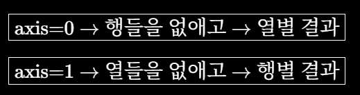

# 행렬 연산과 딥러닝 레이어

> 학습일: 2026-08-05

## 핵심 정리

데이터 행렬 $X$에서는 행 하나가 고객 한 명이고, 열 하나가 고객의 특성 하나이다. 완전연결층은 이 데이터에 가중치 $W$를 곱하고 편향 $b$를 더해 고객별 출력 점수 $Y$를 만든다.

$$
Y = XW + b
$$

가중치는 각 특성을 출력에 얼마나 반영할지 나타내고, 편향은 출력의 기본 기준을 조절한다. 둘 다 사용자가 임의로 정하는 값이 아니라 과거 데이터와 정답을 이용해 모델이 학습한다.

가입 가능성 점수는 기존 가입 고객과의 유사도를 구해서 만드는 것이 아니다. 고객의 특성과 학습된 가중치를 계산하고 편향을 더해서 만든다. 무작위 $W$와 $b$는 Shape와 연산을 확인하는 실습용일 뿐 실제 예측값으로 사용할 수 없다.

$XW$는 선형 변환이고 $XW+b$는 아핀 변환이다. 행렬곱은 가운데 차원이 맞아야 하며 순서도 중요하다. 전치는 행과 열을 바꾸는 연산이고, 두 번 전치하면 원래 행렬로 돌아온다.

> 결국 완전연결층은 여러 고객의 특성을 학습된 가중치와 편향으로 한꺼번에 계산해 필요한 출력 점수로 바꾸는 과정이다.

---

## 가입 가능성 점수는 어떻게 계산하는가?

가입한 고객과 내적 또는 코사인 유사도를 구하는 방식이 아니다.

고객 한 명의 특성 벡터 $\mathbf{x}$와 가중치 $\mathbf{w}$를 내적하고 편향을 더해 점수 $z$를 계산한다.

$$
z = \mathbf{x}\cdot\mathbf{w} + b
$$

이 점수는 바로 확률이 아니다. 이진 분류에서는 보통 시그모이드 함수를 적용해 확률로 바꾼 뒤 기준값과 비교한다.

$$
p = \sigma(z) =
\frac{1}{1+e^{-z}}
$$

```text
고객 특성
  → 가중합과 편향 계산
  → 시그모이드로 확률 변환
  → 기준값과 비교
  → 가입 여부 판단
```

실습에서 무작위로 만든 $W$와 $b$는 행렬 연산과 Shape를 확인하기 위한 값일 뿐 실제 가입 가능성을 나타내지 않는다.

실제 모델에서는 과거 고객의 특성과 실제 가입 여부를 이용해 $W$와 $b$를 학습한다.

---

## 데이터 행렬 X

$X$는 고객 한 명의 데이터가 아니라 여러 고객의 데이터를 모은 전체 행렬이다.

$$
X \in \mathbb{R}^{8\times5}
$$

`X.shape == (8, 5)`라면 다음을 의미한다.

- 행 8개: 고객 8명
- 열 5개: 고객마다 특성 5개
- `X[i]`: $i$번째 고객 한 명의 특성 벡터

실습에서 고객 8명만 사용했다면 전체 데이터 중 일부를 행렬 연산 확인용으로 뽑은 것이다.

일반적인 행렬곱에서는 앞 행렬의 열 개수와 뒤 행렬의 행 개수가 같아야 한다.

```text
A:  (m, n)
B:  (n, p)
AB: (m, p)
```

### NumPy의 axis

`sum`, `mean`, `max` 같은 축소 연산에서 `axis`는 연산하면서 없앨 축을 지정한다.

- `axis=0`: 행들을 없애고 열별 결과를 남긴다.
- `axis=1`: 열들을 없애고 행별 결과를 남긴다.



---

## 가중치와 내적

가중치 자체가 내적인 것은 아니다.

가중치의 부호와 크기는 해당 특성이 출력 점수에 미치는 방향과 정도를 나타낸다.

- 양수 가중치: 특성값이 커질수록 점수를 높이는 방향
- 음수 가중치: 특성값이 커질수록 점수를 낮추는 방향
- 절댓값이 큰 가중치: 점수에 더 큰 변화를 줄 수 있음

다만 자산 금액과 주택 수처럼 특성의 단위가 다르면 가중치 크기를 바로 비교하기 어렵다. `StandardScaler`로 특성의 스케일을 맞추면 가중치를 비교하기 쉬워지지만, 가중치만으로 전체 모델의 특성 중요도를 단정할 수는 없다.

---

## 편향은 왜 더하는가?

편향은 사용자가 직접 정하는 값이 아니라 가중치와 함께 모델이 학습하는 값이다.

입력 특성이 모두 0이면 다음과 같이 출력 점수는 편향이 된다.

$$
\mathbf{x}=\mathbf{0}
\quad\Rightarrow\quad
z=b
$$

편향이 없다면 입력이 0일 때 출력도 항상 0이 되어 모델의 판단 기준이 원점에 고정된다. 편향을 사용하면 데이터에 맞춰 기본 출력 수준을 위나 아래로 조정할 수 있다.

같은 출력에 대해서는 모든 고객에게 같은 편향을 더하므로 고객의 점수 순서는 바뀌지 않는다. 하지만 고정된 판단 기준과 비교한 결과는 달라질 수 있다.

출력이 3개라면 편향도 3개이다.

```text
카드 가입 점수 → 카드 가입용 편향
대출 가입 점수 → 대출 가입용 편향
통장 개설 점수 → 통장 개설용 편향
```

카드 가입 점수 하나만 출력한다면 가중치 벡터 하나와 편향 하나를 사용한다.

---

## 행렬 연산에서 기억할 성질

### 행렬곱의 순서

행렬곱은 일반적으로 순서를 바꾸면 결과가 달라진다.

$$
AB \ne BA
$$

딥러닝에서도 층마다 행렬 연산을 순서대로 수행하므로 층의 순서를 바꾸면 일반적으로 다른 결과가 나온다.

### 전치행렬

전치행렬 $A^T$는 행렬 $A$의 행과 열을 서로 바꾼 행렬이다. 위 첨자 $T$는 제곱이 아니라 전치한다는 연산 표시이다.

전치를 두 번 하면 원래 행렬로 돌아온다.

$$
(A^T)^T = A
$$

두 행렬의 곱을 전치하면 각각을 전치하고 곱하는 순서를 뒤집는다.

$$
(AB)^T = B^T A^T
$$

```text
행렬곱을 전치
→ 각 행렬을 전치
→ 곱하는 순서를 뒤집기
```

---

## np.random.randn()

`np.random.randn()`은 평균이 0이고 표준편차가 1인 정규분포에서 임의의 숫자를 생성한다.

실습에서는 $W$와 $b$의 Shape를 만들고 행렬 연산을 확인하기 위해 사용한다. 무작위 가중치와 편향으로 계산한 결과는 학습된 모델의 예측 결과가 아니다.
