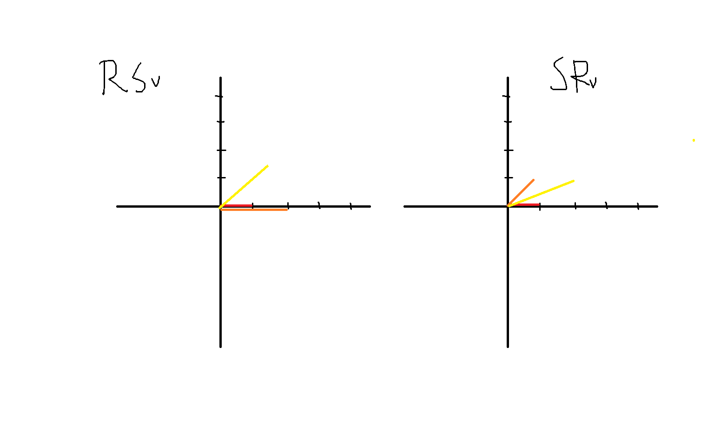

# 선형 변환의 기하학적 해석

> 학습일: 2026-08-05

## 선형 변환

선형 변환은 벡터를 다른 벡터로 바꾸면서 덧셈과 스칼라배를 보존하는 함수이다.

$$
T(\mathbf{u}+\mathbf{v}) =
T(\mathbf{u})+T(\mathbf{v})
$$

$$
T(c\mathbf{u}) =
cT(\mathbf{u})
$$

두 조건을 합치면 다음과 같다.

$$
T(a\mathbf{u}+b\mathbf{v}) =
aT(\mathbf{u})+bT(\mathbf{v})
$$

선형 변환은 반드시 원점을 원점으로 보낸다.

$$
T(\mathbf{0}) = \mathbf{0}
$$

따라서 원점을 다른 위치로 옮기는 평행이동은 선형 변환이 아니라 아핀 변환이다.

---

## 행렬과 표준기저

기저를 정한 유한차원 공간의 선형 변환은 행렬곱으로 표현할 수 있다.

$$
T(\mathbf{v}) = A\mathbf{v}
$$

- $\mathbf{v}$: 변환 전 벡터
- $A$: 변환 규칙을 기록한 행렬
- $A\mathbf{v}$: 변환된 벡터

2차원 표준기저는 다음과 같다.

$$
\mathbf{e}_1 =
\begin{bmatrix}
1 \\
0
\end{bmatrix},
\qquad
\mathbf{e}_2 =
\begin{bmatrix}
0 \\
1
\end{bmatrix}
$$

모든 2차원 벡터는 두 표준기저의 선형결합으로 나타낼 수 있다.

$$
\mathbf{v} =
x\mathbf{e}_1+y\mathbf{e}_2
$$

선형성 때문에 $A\mathbf{e}_1$과 $A\mathbf{e}_2$만 알면 모든 벡터의 변환 결과를 알 수 있다.

$$
A\mathbf{v} =
xA\mathbf{e}_1+yA\mathbf{e}_2
$$

행렬의 각 열에는 표준기저가 어디로 이동하는지가 기록되어 있다.

$$
A =
\begin{bmatrix}
\vert & \vert \\
A\mathbf{e}_1 & A\mathbf{e}_2 \\
\vert & \vert
\end{bmatrix}
$$

격자는 선형 변환 자체가 아니라 공간의 변화를 보기 위한 보조선이다. 공간의 모든 벡터가 변하면 격자도 함께 회전하거나 늘어나고 기울어진 것처럼 보인다.

---

## 대표적인 변환

| 변환 | 특징 |
| --- | --- |
| 회전 | 길이와 각도를 유지하면서 방향을 바꾼다. |
| 스케일링 | 축 방향의 길이를 늘리거나 줄인다. |
| 전단(Shear) | 한 축 방향으로 공간을 기울인다. |
| 반사 | 특정 축이나 직선을 기준으로 뒤집는다. |
| 투영 | 벡터를 특정 직선이나 평면 위로 내린다. |
| 평행이동 | 원점이 움직이므로 선형 변환이 아니라 아핀 변환이다. |

회전에서 $\pi$라디안은 180도이다.

---

## 합성변환

합성변환은 여러 변환을 연속으로 적용하는 것이다. 여러 선형 변환은 행렬곱 하나로 합칠 수 있다.

벡터 $\mathbf{v}$를 먼저 $S$로 스케일한 뒤 $R$로 회전하면 다음과 같다.

$$
\mathbf{v}
\longrightarrow
S\mathbf{v}
\longrightarrow
R(S\mathbf{v}) =
(RS)\mathbf{v}
$$

행렬은 벡터에 가까운 오른쪽 변환부터 적용된다.

즉 $RS\mathbf{v}$는 $S$를 먼저 적용하고 $R$을 적용한다는 뜻이다.

행렬곱은 일반적으로 순서가 중요하므로 먼저 회전한 뒤 스케일하면 다른 결과가 나올 수 있다.

$$
RS\mathbf{v} \ne SR\mathbf{v}
$$

예를 들어 $\mathbf{v}=[1,0]^T$에서 x축 방향을 2배로 늘리고 45도 회전하면 다음과 같다.

$$
R(S\mathbf{v}) \approx
\begin{bmatrix}
1.414 \\
1.414
\end{bmatrix}
$$

반대로 먼저 회전한 뒤 현재 좌표의 x축 방향을 2배로 늘리면 다음과 같다.

$$
S(R\mathbf{v}) \approx
\begin{bmatrix}
1.414 \\
0.707
\end{bmatrix}
$$



*왼쪽은 스케일 후 회전한 $RS\mathbf{v}$, 오른쪽은 회전 후 스케일한 $SR\mathbf{v}$를 나타낸다.*

---

## 선형 변환이 중요한 이유

일반적인 함수는 몇 개의 입력 결과만 보고 전체 변환을 예측하기 어렵다.

선형 변환은 기저벡터가 어디로 가는지만 알면 모든 벡터의 결과를 계산할 수 있다.

```text
2차원 선형 변환
→ e₁의 변환 결과 확인
→ e₂의 변환 결과 확인
→ 모든 벡터의 변환 결과 계산 가능
```

복잡한 비선형 함수도 한 점 주변을 작게 보면 선형 변환으로 근사할 수 있다. 여러 변수 함수에서는 이때의 선형 근사를 야코비안 행렬로 나타낸다.

---

## 신경망과 비선형 함수

신경망에서 가중치 행렬 $W$는 입력 벡터를 늘리고, 줄이고, 회전시키고, 여러 성분을 섞는 변환 규칙으로 볼 수 있다.

$W\mathbf{x}$는 선형 변환이고, 편향을 더한 $W\mathbf{x}+\mathbf{b}$는 아핀 변환이다.

선형 변환만 여러 번 적용하면 결국 하나의 행렬로 합쳐진다.

$$
\mathbf{x}
\longrightarrow
A\mathbf{x}
\longrightarrow
B(A\mathbf{x}) =
(BA)\mathbf{x}
$$

층을 여러 개 쌓아도 중간에 비선형 함수가 없다면 표현력은 하나의 선형 변환과 같다.

ReLU는 음수를 0으로 만들고 양수는 그대로 두는 비선형 함수이다.

$$
\mathrm{ReLU}(z) =
\max(0,z)
$$

선형 또는 아핀 변환 사이에 ReLU 같은 비선형 함수를 넣으면 전체 계산을 행렬 하나로 합칠 수 없다. 이 비선형성 덕분에 신경망은 단순한 회전이나 스케일링만으로 나눌 수 없는 복잡한 관계를 표현할 수 있다.

---

## 한 번에 정리

- **선형 변환:** 벡터의 덧셈과 스칼라배를 보존하는 변환
- **행렬:** 표준기저가 어디로 이동하는지 기록한 변환 규칙
- **격자:** 공간의 변화를 확인하기 위한 시각적 보조선
- **합성변환:** 오른쪽 행렬부터 적용하며 순서가 달라지면 결과도 달라질 수 있음
- **신경망:** 선형·아핀 변환 사이에 비선형 함수를 넣어 복잡한 관계를 표현
